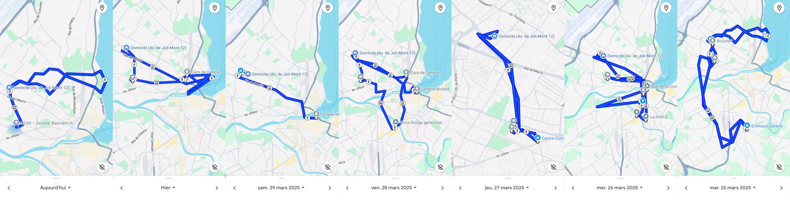

# md-Theory-&-Practice
 MASTER MODULE THEORY AND PRACTICE
 This is the repository with all the development process of the Master in Media Design module of Theory and Practice.

 ## **First Session**
 >Joël Vacheron - joelvacheron@googlemail.com  
 Anais - Anais.bloch@hesge.ch / head.hesge.ch/design-ethnography/ - Dr.Smartphone
 

&nbsp;

 ## **MD Master Thesis Basics** 
        - Personal
        - Practical
        - Pleasant
        - Prospective

* Dissertation: 45.000 - 65.500 characters (an exception may be considered with the authorization of the tutor)
* Submission deadline: end-Nov 2025 
* Defence : mid-February 2026
* Field Research (ethnography/interviews)
* Conclusion: synthesis of the work + 3 ideas for practical projects

**Research prehequesits:**
- Research Question (How people connect to this world of sensing and how this affects people)
- Literature Review
- Method to deal with research question
- Clear presentation of the results, sources and material produced

    
    **Research for Design:** 
            investigation situation/object/practice - prior to changing it in a practicle way;

    **Research through Design:** 
            knowledge/ideas/questions imerse from practice itself;

    **Research on Design:** 
            design as object of study - emerge from the design practice itself - (discipline/objects/practice of design). 

 ### **Sessions:**
1. **First Session: 31/03 - 01/04 (to observe)**
        INSPIRATION 
        - terms/topics + definition
        - 3 potential research questions
        - 10 academic resources (articles, book chapters)
        - visuals about what you're interested in

2. **Second Session: 28/04 - 30/04 (to plan/to craft)**
        METHOD
        - describe your research question
        - motivation to explore it (literature/projects references)
        - choosen methodology
        - clarifications: number of interviews/questions/places you'll observe

3. **Third Session: 26/05 - 28/05 (to make/do)**
        DATA
        - organizing collected data from before
        - interviews
        - 10 min presentation with a format that summarise your analysis (poster, arfitacts, etc.)

4. **Summer Vacation: 20/11**
        OUTPUT
        - various iterations of the Master Thesis text and images

 

### METHODOLOGY
`Define the context > Problematic > Etat de L'Art`
- Hypothesis
- Bibliography
- Online ethnography (research communities)
- Research Questions (What/Who/How/why/when)
- Brainstorm
- Organise the Fieldwork (ex.types, spaces, objects, rites of passage/interactions, tools, context, actors, activities)
- Drafting interview and observation guides
- Observations
- Gestures

### FIELDWORK
`Enquête terrain > Carnet de notes > Comprendre par l'experience (internship)`
 
  - Tag photos (# - to easly find specific images by cathegory)
  - Interviews: Structured, Semi-Structured, Informal
  - Analyze interviews (highlight themes by colors)
  - Mapping (data cathegories)
  - Analyze/Summarize through drawings
  - During interviews: what can you give the persons you're interviewing (how can your research help/be useful to them)
  - Find your place during interviews (what space/position can you occupy without being a burden to other people)
    
  
  ### PUBLICATION
  - Intermediate Objects: production of research (going deeper into specific parallel subjects) 
  - publication/publishing: List of other researchers
  - What are you bringing of NEW
  - Making the book
  - Disseminating research

  ### EXERCICES D'OBSERVATION:
  #### **Exercice#3 - Étude de Parcours**

  `Drawn Maps`
   

   

   

  `Google Maps`
   

   ## **Second Session**
 > 28/4 - Benoit Renaudin

 ### "How to Craft a Research" - 

 Find a research question worth investigating that will lead to a reserach problem worth solving:
1. Find a topic (frame) specific enought that alow you to go deep enough. Let you master a resonable amount of information on it.
2. Question that topic until you find questions that catch your interest
3. Determinate what kind of evidence your readers will expect you to offer (who is your audience? what questions are they going to make? - anticipate)
4. Determinate wheteher you can find this evidence - make sure you have primary sources disponible

#### Preliminary Research:
- exploratory interview
- exploratory observations
- Readings
- Other projects (Design/Art references)

### Assignment 02: Craft a Research Plan
METHOD folder:
- .md file describing your research question 
- motivation to explore it (references - literature/projects)
- choosen methodology (number of interviews, questions, places you'll observe)

                jeu de cartes performatif: https://www.jeudecartesperformatif.com/

Methodology: how you sell your ideas (what is your strategy to sell + to find the right angle that will atract people)
* Choose something you will be happy to talk about/ Obsession/ issues
* Choose methodologies that will make you happy/that are fun
        > interviwers (people working on the field, users, researchers)
        > field research

* Write the thesis as a speculatif story // Nacirema tribe: fictional group created by anthropologist Horace Miner in his 1956 article "Body Ritual Among the Nacirema" - create a deliberate sense of self-distancing in order to look at the research more objectively.

* Use Schematics to sort/analyze reference literature

> 29/4 - Felicien Goguey

 ### Interviews - 

 Prepare the questions to know exactly what you are looking for. Try to learn as much as you can before the interviews.
 Frame 3-4 main topics and then develop 4-5 questions for each one. 

                Frame 3 topics inside the research framework > Design the questions (from more general to more specific)

 * Questions must be semi-open (no YES or NO answers)
 * Anticipate some answers - to be in control of the focus of the interview
 * Start with general questions to let people feel more confortable (small talk/easy to answer/build trust)
 * Allways record (use AI to turns audio to text)
 * After the interview, keep in touch (say you may come back with aditional questions)

#### Research Through Design
- You can use the research ON Design as a first step of your research - developments around your research question into the academic field/design practices
- Identify your place inside your Framework
- Borrow methodologies from other disciplines: technological studies, science, anthropology, digital humanities, psycologie.
        Thinkering: mixing different methods (bricolage)

> Book: Research in Art and Design, 1994 (Frayling, C.)

**Research into Design**
- History
- Aesthetic/Perceptual Design
- Body of Documents
- Research into a variety of theoretical perspectives
- Stabilish typology(Catalogue) in form/colors/functions- evolution (genetic of industrial objects/Philosophy of objects) - Family Tree of Objects - Bestiary
- Carthography/ Technical drawings

**Research through Design**
- Material Research
- Action-practice based research
- Runing tests and making new objects
- Remaking process/reconstruction (archeology)

**Research on Design**
- Propose new projects/designs
- Speculative Design

## **Third Session**
 > 26/5 - Personal Presentation

1. What is your [Intention]
2. What are your [Research_Questions]
3. What are your [References] in Bibliography/Design
4. What is/are your [Methodology]
5. First [Interview_Questions] - some interviews
6. Field Research